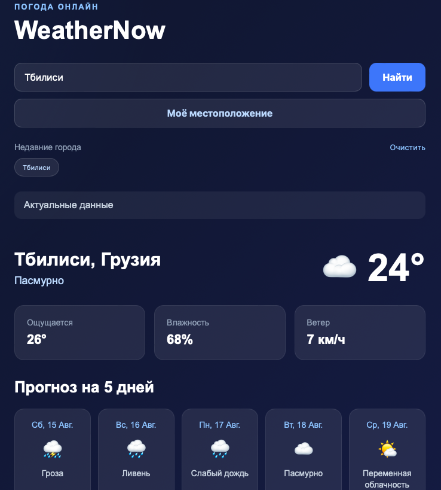

# 👨‍💻 Портфолио Frontend-разработчика

Привет! Меня зовут Мирза.

Я начинающий Frontend-разработчик. Создаю современные, адаптивные и удобные веб-интерфейсы на HTML, CSS и JavaScript.

В этом репозитории находится моё портфолио и практические проекты, на которых я развиваю навыки Frontend-разработки.

## 🖥️ Превью

## 🚀 Live Demo

[🌐 Открыть портфолио](https://mbabaev1.github.io/portfolio/)

## 🛠 Технологии

- HTML5
- CSS3
- JavaScript
- Flexbox
- CSS Grid
- Адаптивная вёрстка
- Fetch API
- REST API
- LocalStorage
- Geolocation API
- Git / GitHub
- GitHub Pages

## 💼 Проекты

### 🌤️ WeatherNow

Приложение погоды с получением актуальных данных через API.

**Основные возможности:**
- поиск погоды по городу;
- определение погоды по геолокации;
- текущая и ощущаемая температура;
- влажность и скорость ветра;
- прогноз на 5 дней;
- погодные иконки;
- история последних городов;
- сохранение истории через LocalStorage;
- очистка истории поиска;
- адаптивный интерфейс.

**Технологии:** HTML, CSS, JavaScript, Fetch API, Geolocation API, LocalStorage

[🌐 Demo](https://mbabaev1.github.io/portfolio/projects/weather/) · [💻 Исходный код](https://github.com/mbabaev1/portfolio/tree/main/projects/weather)

---

### 🛒 NovaShop

Интернет-магазин с поиском, фильтрацией, сортировкой и интерактивной корзиной.

**Основные возможности:**
- поиск товаров;
- фильтрация по категориям;
- сортировка по цене;
- добавление товаров в корзину;
- изменение количества товаров;
- удаление товаров;
- автоматический подсчёт итоговой суммы;
- сохранение корзины через LocalStorage;
- оформление заказа;
- адаптивный интерфейс.

**Технологии:** HTML, CSS, JavaScript, LocalStorage

[🌐 Demo](https://mbabaev1.github.io/portfolio/projects/shop/) · [💻 Исходный код](https://github.com/mbabaev1/portfolio/tree/main/projects/shop)

---

### 🚗 Автосервис

Адаптивный лендинг автосервиса с современным интерфейсом, блоками услуг и удобной навигацией для клиентов.

**Основные возможности:**
- адаптивная вёрстка;
- современный интерфейс;
- блок услуг;
- удобная навигация;
- мобильная версия.

**Технологии:** HTML, CSS, JavaScript

[🌐 Demo](https://mbabaev1.github.io/portfolio/projects/autoservice/) · [💻 Исходный код](https://github.com/mbabaev1/portfolio/tree/main/projects/autoservice)

---

### ☕ Кофейня

Адаптивный сайт кофейни с уютным визуальным стилем, блоком меню и удобной структурой для знакомства с заведением.

**Основные возможности:**
- адаптивный интерфейс;
- блок меню;
- навигация по странице;
- современное оформление;
- мобильная версия.

**Технологии:** HTML, CSS, JavaScript

[🌐 Demo](https://mbabaev1.github.io/portfolio/projects/coffee/) · [💻 Исходный код](https://github.com/mbabaev1/portfolio/tree/main/projects/coffee)

---

### 🏗️ Строительная компания

Адаптивный сайт строительной компании с современным дизайном, блоками услуг и удобной структурой для потенциальных клиентов.

**Основные возможности:**
- адаптивная вёрстка;
- блок услуг;
- современный дизайн;
- навигация по странице;
- мобильная версия.

**Технологии:** HTML, CSS, JavaScript

[🌐 Demo](https://mbabaev1.github.io/portfolio/projects/construction/) · [💻 Исходный код](https://github.com/mbabaev1/portfolio/tree/main/projects/construction)

## 📚 Что я практикую

В проектах я развиваю навыки:

- семантической HTML-разметки;
- адаптивной вёрстки;
- Flexbox и CSS Grid;
- работы с DOM;
- обработки событий JavaScript;
- работы с API через Fetch;
- `async / await`;
- LocalStorage;
- Geolocation API;
- организации структуры Frontend-проектов;
- публикации проектов через GitHub Pages.

## 🎯 Цель

Развиваться как Frontend-разработчик, создавать качественные адаптивные интерфейсы, работать над реальными проектами и постепенно осваивать современные инструменты веб-разработки.

## 📫 Контакты

- GitHub: https://github.com/mbabaev1
- Email: qfast@internet.ru
